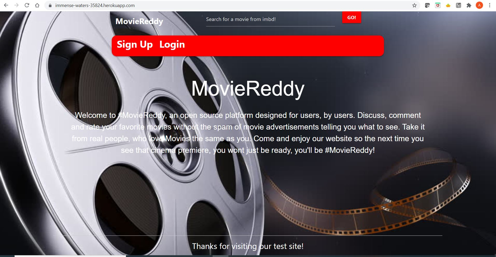

# MovieReddy

## Purpose

Tired of seeing bad movies, or don’t know what to watch?
Well have no fear, MovieReddy is here! MovieReddy is an application designed to allow users to write movie reviews, view movie reviews and find out more information about any movie you desire! This way, you’re always be MovieReddy!

MovieReddy Details:

- Allows users to write, edit & delete their own movie reviews:
  - Movie title
  - Review
  - Genre
  - Star Rating
- Allows users to see their own posts & comments through the dashboard.
- Home page allows users:
  - To see all user posts
  - Comment on other user posts
  - Upvote on other user posts
- Search any movie and receive:
  - Movie Title (searched)
  - Movie Poster
  - Movie Overview
  - IMDb Score

## Built With

- moviedb-promise package
- Materialize
- JavaScript
- Node.js
- Express.js
- Handlebars.js
- MySQL
- Sequelize ORM
- express-session
- dotenv
- bcrypt
- Jquery
- AwesomefontsLibrary

## Website

https://immense-waters-35824.herokuapp.com/

## Screenshot

## Contribution

Made by the MovieReddy Team - Archita Racherla, Fred McWilliams, Marcos Badillo, & Pedro Cervantes.
